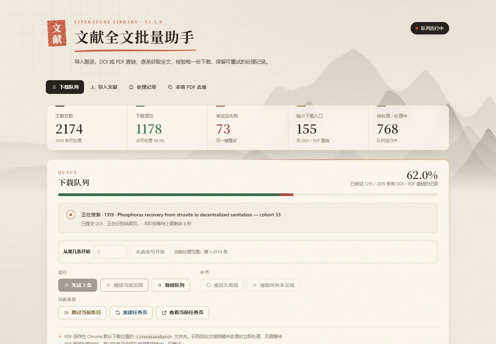
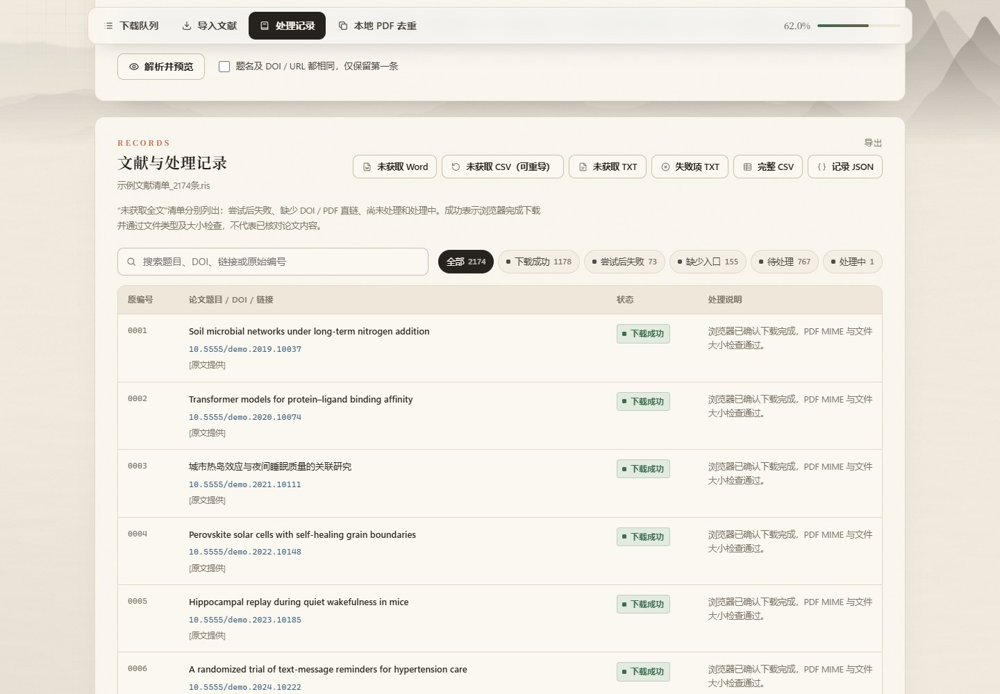
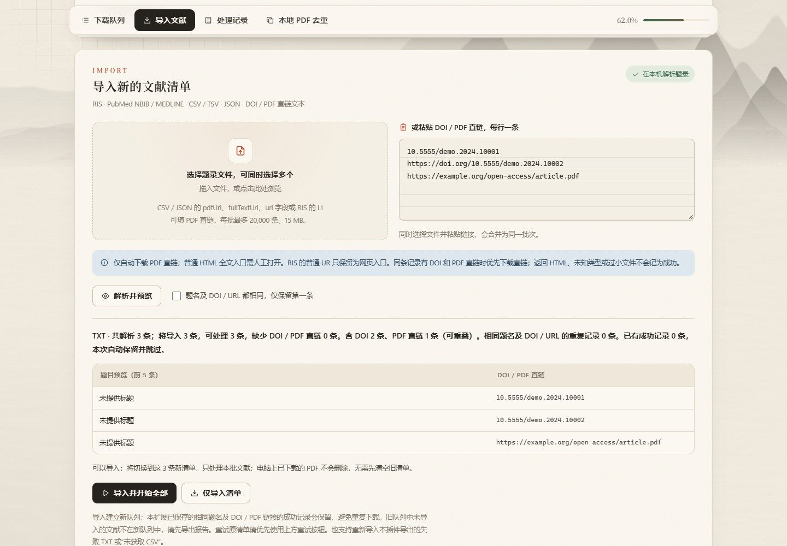

<p align="center"></p>

<h1 align="center">文献全文批量助手</h1>

<p align="center">
按题录清单批量获取论文 PDF，逐条核验下载结果，一键导出没拿到的文献。<br>
Chrome 扩展（Manifest V3）· 题录只在本机解析 · 和纸与朱印风格的界面
</p>

<p align="center">
<a href="#安装">安装</a> · <a href="#使用流程">使用流程</a> · <a href="#支持的题录格式">题录格式</a> · <a href="#隐私与权限">隐私与权限</a> · <a href="#开发">开发</a> · <a href="#english">English</a>
</p>

<picture>
  <source media="(prefers-color-scheme: dark)" srcset="docs/screenshots/dashboard-dark.jpg">
  
</picture>

写综述或系统评价时，参考文献常常上千条。逐篇点开、下载、改名、记录哪些没拿到，既慢又容易漏。这个扩展把整份清单变成一个可暂停、可续跑的队列：每条文献的结果都有记录，失败的可以一键重试，最后导出一份「未获取全文」清单交给图书馆或人工补齐。

<p align="center">
  <a href="https://github.com/XiaoSong2023/literature-batch-assistant/releases/download/v1.5.0/literature-batch-assistant-promo.mp4"></a><br>
  <sub>▶ 点击观看 67 秒产品介绍视频（MP4，32 MB）。界面画面录自本扩展，使用虚构示例数据，下载过程已加速。</sub>
</p>

## 功能

- **导入题录**：RIS、PubMed NBIB / MEDLINE、CSV / TSV、JSON，或直接粘贴 DOI / PDF 直链；可同时选多个文件，解析后先预览再导入，可按「题名 + DOI / URL」去重。
- **批量获取**：有 PDF 直链的条目直接交给 Chrome 下载；只有 DOI 的条目在 sci-hub.box 的检索页逐条提交，并读取结果页（含 sci-net.xyz 论文页）里的 PDF 地址。
- **逐条核验**：只有 Chrome 下载记录为完成、MIME 为 PDF、文件不小于 1 KB 才记为成功；返回 HTML 或过小的文件会写明原因，不会被当成已下载。
- **断点续跑**：暂停、关闭面板、浏览器重启后都能继续；可从第 N 条开始，可只重试失败项，或一次补齐全部未完成。
- **导出报告**：未获取 Word（.docx）、可重新导入的 CSV、TXT、完整 CSV 与 JSON 记录。
- **本地 PDF 去重**：扫描你选择的下载文件夹，只清理内容完全一致（SHA-256）的 `(1)`、`(2)` 副本，删除前逐个再次比对。
- **界面**：和纸纹理、水墨远山、朱印与宋体标题；数字滚动、运行中的光边与圆相动画；自动适配深色模式，并遵循系统「减少动态效果」设置。

| 处理记录与导出 | 导入预览 |
| --- | --- |
|  |  |

## 安装

1. 在 [Releases](../../releases) 下载 `literature-batch-assistant-v1.5.0.zip` 并解压；或 `git clone` 本仓库。
2. 打开 `chrome://extensions`，打开右上角「开发者模式」。
3. 点击「加载已解压的扩展程序」，选择包含 `manifest.json` 的文件夹（克隆仓库时选 `extension` 文件夹）。
4. 点击工具栏上的朱印「文」图标，打开控制面板。

> **更新时不要卸载重装。** 队列和进度保存在扩展的本地存储里，卸载会一起清除。把新版文件覆盖到原来加载的同一个文件夹，再在 `chrome://extensions` 点「重新加载」即可，扩展 ID 和进度都会保留。

本扩展目前不在 Chrome 应用商店上架，只能以「加载已解压的扩展程序」方式安装。

## 使用流程

1. **导入题录**：在数据库里导出题录（PubMed 可用 *Send to → Citation manager → Create file* 得到 `.nbib`），拖进导入区或粘贴 DOI，点「解析并预览」核对数量后导入。
2. **批量获取**：先点「先试 3 条」确认一切正常，再点「继续当前范围」。运行中顶部徽标显示状态，面板显示当前文献和本阶段剩余等待时间。
3. **核验文件**：PDF 保存在 Chrome 默认下载目录的 `LiteratureBatch` 文件夹，文件名形如 `0600_论文题目_10.1234_example.pdf`。
4. **导出补齐**：一轮结束后点「重试失败项」或「继续所有未完成」；仍未获取的导出为 Word / CSV，CSV 可以直接重新导入。

遇到网站的人工验证页时，队列会停在当前条目等待，你在任务页完成验证后自动继续；也可以「重建任务页」或「跳过当前条目」。

## 支持的题录格式

| 文件 | 读取字段 |
| --- | --- |
| RIS | `TI` / `T1` 题目，`DO` DOI，`UR` 中明确的 doi.org 链接；`L1` 作为 PDF 直链，普通 `UR` 只作为人工网页入口 |
| PubMed NBIB / MEDLINE | `TI` 题目，带 `[doi]` 标记的 `AID` / `LID`；不把 PMID 或 PII 当作 DOI |
| CSV / TSV | `title` / `doi` 及常见中文表头；PDF 直链填 `pdfUrl`、`fullTextUrl` 或 `url`；网页入口填 `landingUrl` |
| JSON | 文献数组，或含 `papers` / `records` / `items` 数组的对象 |
| TXT / 粘贴 | 每行一个 DOI、`doi:` 开头的 DOI、doi.org 链接或 HTTP(S) PDF 直链；也能读本扩展导出的未获取 TXT |

每批最多 20,000 条、合计 15 MB，文本需为 UTF-8。没有 DOI 和直链的记录会保留在清单和报告里，不会被丢弃，也不会被编造 DOI。

最简单的直链 CSV：

```csv
index,title,pdfUrl
1,论文题目,https://example.org/article.pdf
```

## 设置

在「速度与验证设置」里调整。上限只是最长等待时间，识别到结果会立即处理。

| 设置 | 默认值 | 含义 |
| --- | ---: | --- |
| 条目间隔 | 1 秒 | 一条结束后到下一条开始的间隔，最小 0.25 秒 |
| 首页等待上限 | 25 秒 | 检索首页迟迟不出现输入框时的等待上限 |
| 结果识别上限 | 12 秒 | 提交 DOI 后无法判断结果时记为「未确认」，可重试 |
| 下载等待上限 | 300 秒 | 已发起下载后的总等待上限；网络中断最多自动恢复 2 次 |
| 自动重建任务页 | 45 秒 | 验证长时间未完成时，自动重开一次当前任务页 |

另有一个开关：在 sci-hub.box 已识别的「Are you a robot?」页面自动点击「No」（默认开启，可关闭）。它只点击按页面结构和文字精确匹配的按钮，验证本身仍由网站完成。

## 隐私与权限

- 题录只在本机解析，进度保存在 `chrome.storage.local`；没有统计、没有远程代码、不向任何服务器上传清单。
- 只在本扩展自己打开的任务标签页里读取和操作页面，且仅限 `sci-hub.box` 与 `sci-net.xyz` 两个域名。

| 权限 | 用途 |
| --- | --- |
| `downloads` | 交给 Chrome 下载 PDF，并读取下载记录核验结果 |
| `storage`、`unlimitedStorage` | 在本机保存数千条题录和处理进度 |
| `tabs`、`scripting`、`webNavigation` | 打开任务页、提交 DOI、尽早识别结果页 |
| `alarms` | 后台休眠后按时继续队列 |
| 站点权限 `sci-hub.box`、`sci-net.xyz` | 读取检索结果页里的 PDF 地址 |

本地去重只访问你在系统对话框里亲自选择的文件夹（File System Access API）。

## 说明与免责

本项目只是浏览器自动化工具：检索和下载都在你自己的浏览器里发生，项目不托管、不分发任何论文。能否合法获取某篇文献，取决于你所在地区的法律、出版商的许可和所在机构的订阅；请只获取你有权访问的内容，并遵守相关网站的使用条款。DOI 检索依赖第三方网站的页面结构，网站改版或更换域名后可能需要适配。

## 开发

不需要构建步骤，`extension/` 文件夹就是可加载的扩展。

```bash
npm install
npx playwright install chromium
npm test            # 168 项单元与浏览器测试（本地页面，不访问外网）
npm run test:mv3    # 在 Chromium 中加载真实扩展，用本地合成 PDF 验证下载流程
```

| 命令 | 作用 |
| --- | --- |
| `npm run screenshots` | 用虚构示例数据生成 `docs/screenshots` |
| `npm run icons` | 重新渲染朱印图标 |
| `npm run font` | 按标题文字重新裁剪 Noto Serif SC 子集（标题文字有改动时运行） |
| `npm run release` | 打包 `dist/literature-batch-assistant-v版本号.zip` |

想在扩展里预置一份题录，可放一个 `extension/bundled-papers.json`（`{"papers": [{"title": "…", "doi": "…"}]}`），首次安装时会自动载入；该文件已被 `.gitignore` 排除。`tools/extract_bibliography.py` 可以从编号格式的 Word 参考文献生成它。

## 更新记录

- **1.5.0**：全新界面（和纸 / 水墨 / 朱印风格、深色模式、动效与吸顶导航）；状态筛选标签带计数；拖放导入并列出已选文件；页内确认对话框取代浏览器弹窗；空清单引导；扩展图标；公开版首次安装从空队列开始。
- **1.4.x**：重试失败项与补齐全部未完成、可重导 CSV 与 Word 报告、网络中断自动恢复。

## English

**Literature Batch Assistant** is a Manifest V3 Chrome extension for researchers working through long reference lists. Import RIS, PubMed NBIB, CSV/TSV, JSON or plain DOI / PDF-link lists; the extension works through them as a resumable queue, downloads direct PDF links through Chrome, looks up DOIs through the sci-hub.box search page, verifies every download (completed, PDF MIME type, at least 1 KB), and exports what is still missing as Word, CSV or TXT. A local de-duplication tool removes byte-identical `(1)` / `(2)` copies from a folder you pick. Everything is parsed locally; nothing is uploaded. The UI is in Chinese.

You are responsible for using it only for content you have the right to access under your local law and your institution's licences. Install with **Load unpacked** from `chrome://extensions` (Developer mode).

## License

[MIT](LICENSE)。界面标题字体为 Noto Serif SC 的子集，按 [SIL Open Font License 1.1](extension/fonts/OFL.txt) 授权。
